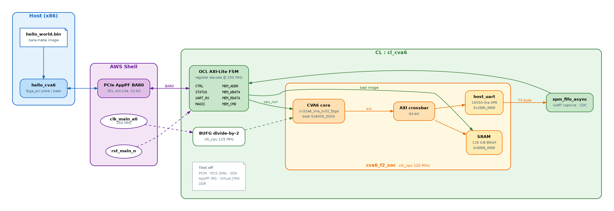
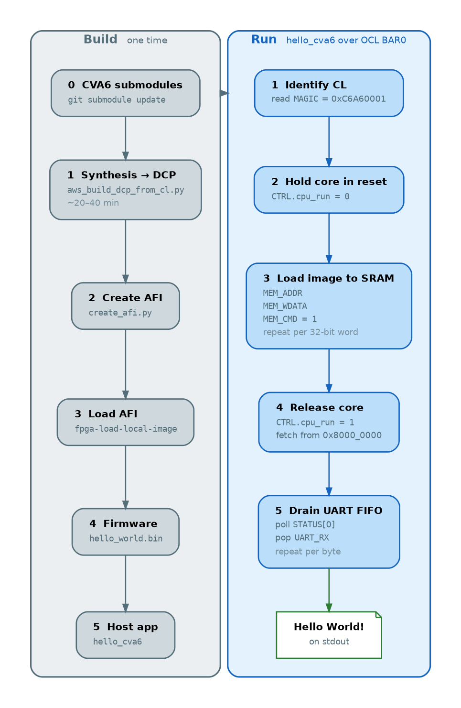

# CL_CVA6 — CVA6 RISC-V on AWS F2

## Table of Contents

1. [Overview](#overview)
2. [Top-level block diagram](#top-level-block-diagram)
3. [Flow](#flow)
4. [Complete command flow](#complete-command-flow)
5. [Software and runtime](#software-and-runtime)
6. [Changes](#changes)
7. [OCL register map](#ocl-register-map)
8. [Next steps](#next-steps)

## Overview

This Custom Logic (CL) wraps a **minimal CVA6 SoC** so an F2 host can load a bare-metal image into on-chip SRAM and print **Hello World** by polling a host-visible UART FIFO.

It is the F2 analogue of the Genesys-2 APU bring-up, with the AWS Shell replacing board UART, DDR, and JTAG. Control uses the same **OCL AXI-Lite** BAR as `cl_axil_reg_access` (AppPF BAR0).

The CPU configuration is **`cv32a6_ima_sv32_fpga`** (32-bit, FPGA-friendly). The core boots at **`0x80000000`**. There is no SD card, DDR/HBM, CLINT, bootrom, or RISC-V debug module in this first bring-up.

## Top-level block diagram



Unused Shell ports (PCIM, PCIS DMA, SDA, AppPF IRQs, Virtual JTAG, DDR DIMM) are tied off. DDR uses `unused_ddr_template.inc` instead of a live `sh_ddr` master.

Text view of the same hierarchy:

```text
  Host (x86)                AWS Shell                 CL : cl_cva6
  ----------                ---------                 ------------
  hello_cva6  <--OCL-->  AppPF BAR0        OCL AXI-Lite FSM + reg decode
  hello_world.bin        (AXI-Lite 32b)      |  CTRL  STATUS  UART_RX  MAGIC
                         clk_main_a0         |  MEM_ADDR/WDATA/RDATA/CMD
                         250 MHz             |
                         rst_main_n          |  cpu_run (CDC)    host load (toggle CDC)
                                             v                       |
                                    +---- cva6_f2_soc @ clk_cpu 125 MHz ---+
                                    |  CVA6 cv32a6_ima_sv32_fpga     |     |
                                    |     |  AXI                     v     |
                                    |  AXI crossbar --> SRAM 128 KiB BRAM   |
                                    |     |             @ 0x8000_0000       |
                                    |     +-----------> host_uart           |
                                    |                   @ 0x1000_0000       |
                                    +--------------------|-----------------+
                                                         | TX byte
                                                         v
                                             xpm_fifo_async (UART capture, CDC)
                                                         |
                                              STATUS count / UART_RX pop
```

Diagram sources are in `docs/*.dot`. Regenerate with:

```bash
cd $CL_DIR/docs
dot -Tpng -Gdpi=140 cl_cva6_block_diagram.dot -o cl_cva6_block_diagram.png
dot -Tpng -Gdpi=140 cl_cva6_boot_flow.dot     -o cl_cva6_boot_flow.png
```

## Flow

End-to-end bring-up. Copy-paste commands are in [Complete command flow](#complete-command-flow).



```text
 1. Init CVA6 submodules used by this CL
 2. Build firmware  ->  firmware/hello_world.bin
 3. Build DCP       ->  aws_build_dcp_from_cl.py -c cl_cva6
 4. Submit AFI      ->  create_afi.py  (same as cl_axil_reg_access)
 5. Load image      ->  fpga-load-local-image
 6. Run host app    ->  sudo ./hello_cva6 --bin ../../firmware/hello_world.bin
```

Host software sequence (`software/src/hello_cva6.c`):

1. Map OCL (BAR0) and read `MAGIC` (`0xC6A60001`) to confirm the CL.
2. Write `CTRL.cpu_run = 0` so CVA6 stays in reset.
3. Stream the binary into SRAM: for each 32-bit word, write `MEM_ADDR` (byte offset from `0x80000000`), `MEM_WDATA`, then `MEM_CMD = 1`.
4. Write `CTRL.cpu_run = 1`. The core comes out of reset and fetches from `0x80000000`.
5. Poll `STATUS` bit 0. When set, read `UART_RX` (pops one TX byte) until `"Hello World!\n"` is collected.

Inside the FPGA:

1. OCL AXI-Lite FSM runs on `clk_main_a0` (250 MHz) and decodes BAR0 accesses.
2. A BUFG toggle divides that clock by 2 to **`clk_cpu` at 125 MHz**. `cva6_f2_soc` (core, SRAM, UART) lives entirely in that domain. `cpu_run` and `MEM_CMD` pulses are synchronised across the boundary.
3. After release, CVA6 issues AXI through the crossbar: instruction/data to SRAM, UART MMIO at `0x10000000`.
4. `host_uart` presents a 16550-like APB register file. TX bytes go `ready/valid` into `xpm_fifo_async`; the host drains that FIFO over OCL on `clk_main_a0`.

Synthesis file list is generated at build time by `build/scripts/gen_cva6_sources.py` from the CVA6 Makefile (`print_cva6_src.mk`), then filtered for this minimal SoC.

## Complete command flow

Paths below assume this layout:

```text
AWS_FPGA_REPO_DIR = /projects/prj1/sle-wajahat/aws-fpga
CVA6_REPO_DIR     = /projects/prj1/sle-wajahat/cva6
CL_DIR            = $AWS_FPGA_REPO_DIR/hdk/cl/examples/cl_cva6
```

Set them once:

```bash
export AWS_FPGA_REPO_DIR=/projects/prj1/sle-wajahat/aws-fpga
export CVA6_REPO_DIR=/projects/prj1/sle-wajahat/cva6
export CL_DIR=$AWS_FPGA_REPO_DIR/hdk/cl/examples/cl_cva6
export TARGET_CFG=cv32a6_ima_sv32_fpga
export AWS_DEFAULT_REGION=us-east-1
export AWS_REGION=us-east-1
```

Long Vivado jobs: run from tmux (`tmux new -s cva6` or a dedicated window) so closing Cursor does not kill the process group.

### 0. CVA6 submodules (once)

```bash
cd $CVA6_REPO_DIR
git submodule update --init --depth 1 \
  core/cvfpu \
  core/cache_subsystem/hpdcache \
  corev_apu/axi_mem_if \
  corev_apu/register_interface \
  corev_apu/fpga/src/axi2apb \
  corev_apu/fpga/src/axi_slice
```

`axi_slice` is required by `axi2apb_64_32`. pulp `common_cells/src/sync.sv` is **not** compiled into this CL (name collision with the AWS Shell `sync`).

### 1. HDK environment and DCP (~20–40 min)

`CL_DIR` must already point at `cl_cva6` before `hdk_setup.sh`, or the DCP script errors with `$CL_DIR path is not in current build dir`.

Do **not** pass `--clock_recipe_*`. Those flags require `--aws_clk_gen`. `clk_main_a0` is 250 MHz; CVA6 is divided to 125 MHz inside the CL.

`--no-encrypt` is recommended so Vivado prints real RTL errors instead of “encrypted envelope”.

```bash
cd $AWS_FPGA_REPO_DIR
set --
source hdk_setup.sh

cd $CL_DIR/build/scripts
python3 aws_build_dcp_from_cl.py -c cl_cva6 --no-encrypt
```

Success looks like `SUCCESS: Design has no negative slack path` and a non-`VIOLATED` checkpoint, for example:

```text
$CL_DIR/build/checkpoints/cl_cva6.<TAG>.post_route.dcp
$CL_DIR/build/checkpoints/<TAG>.Developer_CL.tar
```

A 250 MHz (no divider) build writes `post_route.VIOLATED.dcp` and must not be submitted. Timing-clean 125 MHz example from this port: tag `2026_08_25-125228`.

### 2. Create the AFI

Needs an instance IAM role with S3 + `ec2:CreateFpgaImage`. `create_afi.py` must run in the HDK venv (`boto3` extras). Export `AWS_DEFAULT_REGION` **before** the script: it probes EC2 at import time and raises `NoRegionError` otherwise.

```bash
cd $AWS_FPGA_REPO_DIR
source hdk/scripts/start_venv.sh

$AWS_FPGA_REPO_DIR/hdk/scripts/create_afi.py \
  --region us-east-1 \
  --dcp-path $CL_DIR/build/checkpoints/<TAG>.Developer_CL.tar \
  --name cl_cva6 \
  --description "CVA6 hello world 125 MHz"
```

Replace `<TAG>` with the timestamp printed by the DCP build. The script prompts for S3 bucket / prefixes and optional email. When it finishes:

```text
AFI ID:  afi-...
AGFI ID: agfi-...
```

Example from this bring-up: `agfi-0e09b20bf8d54780c`.

### 3. Load the AFI on this F2 instance

```bash
cd $AWS_FPGA_REPO_DIR
source sdk_setup.sh

sudo fpga-clear-local-image -S 0
sudo fpga-load-local-image -S 0 -I agfi-<YOUR_AGFI>
sudo fpga-describe-local-image -S 0 -H
```

`StatusName` must be `loaded` and `FpgaImageId` must match the AGFI.

### 4. Build firmware

Ubuntu does not ship `riscv32-unknown-elf-gcc`. `gcc-riscv64-unknown-elf` with `-march=rv32ima -mabi=ilp32 -nostdlib` is enough.

```bash
sudo apt-get install -y gcc-riscv64-unknown-elf
cd $CL_DIR/firmware
make PREFIX=riscv64-unknown-elf
```

Produces `hello_world.bin`. UART baud math uses **125 MHz** (`init_uart(125000000, 115200)`).

If you have `riscv32-unknown-elf-gcc`, `make` with no `PREFIX` is fine.

### 5. Build host software and run Hello World

Needs `SDK_DIR` from `source sdk_setup.sh` (step 3). `make` links `libfpga_mgmt`.

```bash
cd $CL_DIR/software/runtime
make
sudo ./hello_cva6 --bin ../../firmware/hello_world.bin
```

`sudo` is required: AppPF BAR0 is only mapped for root (or a user in the FPGA device group). Flags: `--slot N` (default 0), `--bin PATH` (default `../firmware/hello_world.bin`), `--verify` (negative control; see [Software and runtime](#software-and-runtime)).

Expected:

```text
cl_cva6 MAGIC ok
Loading 708 bytes from .../hello_world.bin
Releasing CVA6 reset
--- UART from CVA6 ---
Hello World!

--- done, 14 byte(s) ---
```

Fourteen bytes is `"Hello World!\r\n"` from the firmware. The host never contains that string; it only `putchar`s bytes popped from `UART_RX`.

## Software and runtime

Two programs talk to the FPGA. Nothing else in this example is host-side software.

| Role | ISA | Path | Output |
|------|-----|------|--------|
| Bare-metal firmware | RV32IMA / ILP32 | `firmware/` | `hello_world.bin` loaded into SRAM |
| Host loader / UART drain | x86_64 | `software/` | `software/runtime/hello_cva6` |

```text
firmware/
  crt.S              reset vector, stack, BSS, call main
  link.ld            link at 0x80000000, stack at 0x80010000
  uart.h / uart.c    16550-like MMIO driver at 0x10000000
  hello_world.c      init UART, print, spin
  Makefile           gcc + objcopy → .elf / .bin / .dump

software/
  include/cl_cva6_def.h   BAR0 offsets (must match design/cl_cva6_defines.vh)
  src/hello_cva6.c        load image, run core, drain UART
  runtime/Makefile        gcc + libfpga_mgmt → hello_cva6
```

### CVA6 memory map (firmware view)

| Range | Size | Contents |
|-------|------|----------|
| `0x80000000`–`0x8001FFFF` | 128 KiB BRAM | code, data, BSS, stack |
| `0x80000000` | — | `_start` / reset vector (`crt.S`) |
| `0x80010000` | — | `_sp` (64 KiB above base, still inside SRAM) |
| `0x10000000` | APB UART | `host_uart` 16550-like registers |

There is no libc, heap, CLINT, PLIC, bootrom, or filesystem. `objcopy -O binary` flattens the ELF so file offset 0 is the instruction at `0x80000000`. Host `MEM_ADDR` is that same byte offset (hardware adds `0x80000000`). Current `hello_world.bin` is 708 bytes.

### Firmware files

**`crt.S`** — `_start` in `.text.init`. Sets `sp` from `_sp`, zeros `_bss_start`…`_bss_end`, `jal main`, then infinite loop. No toolchain `crt0`.

**`link.ld`** — `OUTPUT_ARCH(riscv)`, `ENTRY(_start)`, origin `0x80000000`. Sections: `.text` (`.text.init` first), `.rodata`, `.data`/`.sdata`, `.bss`. Stack is a symbol at `0x80010000`, not a `.stack` section.

**`uart.h` / `uart.c`** — MMIO at `UART_BASE 0x10000000` (word-spaced 16550: THR/RBR `+0`, IER `+4`, FCR/IIR `+8`, LCR `+12`, MCR `+16`, LSR `+20`). `init_uart(freq, baud)` programs the divisor as `freq / (baud << 4)`. This port must pass **`125000000`** to match `clk_cpu`. `print_uart` polls LSR bit 5 (THR empty) and writes THR. Extra helpers (`print_uart_int` / `_addr` / `_byte`) hex-dump values; hello world only uses `print_uart`.

**`hello_world.c`** — `init_uart(125000000, 115200); print_uart("Hello World!\r\n");` then `while (1)`. The hang is required: there is no `exit` / `wfi` handler, and returning from `main` would fall into `crt.S`'s spin anyway.

**`firmware/Makefile`**

| Variable / flag | Default / value |
|-----------------|-----------------|
| `PREFIX` | `riscv32-unknown-elf` (Ubuntu: `make PREFIX=riscv64-unknown-elf`) |
| `-march` / `-mabi` | `rv32ima` / `ilp32` |
| `-nostdlib -nostartfiles` | no libc, use `crt.S` |
| `-T link.ld` | memory layout above |

Targets: `hello_world.elf`, `hello_world.bin` (`objcopy -O binary`), `hello_world.dump` (`objdump -d`). `make clean` removes those three.

### Host files

**`software/include/cl_cva6_def.h`** — BAR0 byte offsets and constants used by `hello_cva6.c`. Keep in lockstep with `design/cl_cva6_defines.vh`.

| Macro | Value |
|-------|-------|
| `CL_CVA6_CTRL` … `CL_CVA6_MEM_CMD` | `0x00` … `0x1C` (see [OCL register map](#ocl-register-map)) |
| `CL_CVA6_MAGIC_VAL` | `0xC6A60001` |
| `CL_CVA6_MEM_WRITE` / `MEM_READ` | `1` / `2` |

**`software/src/hello_cva6.c`** — x86 process. It does **not** execute RISC-V and does **not** contain the string `"Hello World!"`. It only peeks/pokes AppPF BAR0 via the AWS FPGA SDK.

Dependencies: `fpga_pci.h` (`fpga_pci_attach` / `peek` / `poke` / `detach`), `fpga_mgmt.h` (`fpga_mgmt_init`), `utils/lcd.h` (`fail_on`, logging). Link with `-lfpga_mgmt` from `$SDK_DIR/userspace/lib/so`.

Helpers:

- `mem_store(bar, addr, data)` — poke `MEM_ADDR`, `MEM_WDATA`, `MEM_CMD = 1`, then `usleep(2)` so the CDC pulse is seen in the 125 MHz domain.
- `drain_uart(bar, idle_limit_ms, echo)` — poll `STATUS[0]`; if set, peek `UART_RX` (pops one byte). Stops after `idle_limit` consecutive empty milliseconds. Returns byte count, or `-1` on PCIe error.

`main` sequence:

1. Parse `--slot N`, `--bin PATH`, `--verify`.
2. `fpga_mgmt_init()`, attach `FPGA_APP_PF` / `APP_PF_BAR0` on `slot_id`.
3. Peek `MAGIC`; exit if not `0xC6A60001` (wrong AFI or empty slot).
4. Poke `CTRL = 0` (hold CVA6 in reset). SRAM port is then owned by the host mux.
5. Read the `.bin` into a 4-byte-padded buffer; for each word, `mem_store(offset, word)` with `offset` from 0.
6. If `--verify`: flush leftover FIFO bytes (200 ms, no echo), then drain 2000 ms **still in reset**. Expect **0** bytes.
7. Poke `CTRL = 1` (release reset). Core fetches from `0x80000000`.
8. Drain UART 2000 ms with echo. Expect **14** bytes (`Hello World!\r\n`).
9. `fpga_pci_detach`.

**`software/runtime/Makefile`** — `gcc -std=gnu11 -Wall -Werror -DCONFIG_LOGLEVEL=4`. `check_env` fails if `SDK_DIR` is unset (`source sdk_setup.sh` first). Include paths: `../include` and `$SDK_DIR/userspace/include`.

### Runtime: how the two programs meet

```text
hello_cva6 (x86)                    FPGA
  fopen hello_world.bin
  poke MEM_*  while cpu_run=0   -->  BRAM at 0x80000000 (host mux)
  poke CTRL=1                   -->  CVA6 _start → main → print_uart
  peek STATUS / UART_RX         <--  host_uart TX → xpm_fifo_async
  putchar(byte)
```

SRAM arbitration is exclusive: `cpu_run=0` → host port; `cpu_run=1` → AXI from the core. Loading while the core is running is not supported.

### `--verify` (prove it is not a host printf)

Same process, two phases, only `CTRL` differs:

```bash
sudo ./hello_cva6 --bin ../../firmware/hello_world.bin --verify
```

```text
cl_cva6 MAGIC ok
Loading 708 bytes from ../../firmware/hello_world.bin
Flushed 0 stale UART byte(s)
--- phase A: image loaded, core STILL HELD IN RESET ---
phase A bytes: 0  ->  PASS (silent, nothing but the core can drive the UART)
Releasing CVA6 reset
--- UART from CVA6 ---
Hello World!

--- done, 14 byte(s) ---
phase B bytes: 14  ->  PASS (traffic appeared only after reset release)
```

Phase A silent means BAR0 stores do not loop back into `UART_RX`. Phase B after `cpu_run=1` means CVA6 executed the image. `strings hello_cva6` must not contain `Hello World`.

### Runtime environment

| Item | Required for |
|------|----------------|
| `source $AWS_FPGA_REPO_DIR/sdk_setup.sh` | `SDK_DIR`, `fpga-*` tools, `libfpga_mgmt` |
| `sudo` | `fpga-load-local-image`, `hello_cva6` BAR access |
| AFI `StatusName=loaded` | `fpga-describe-local-image -S 0 -H` |
| `gcc-riscv64-unknown-elf` (or riscv32) | firmware rebuild |
| Host `gcc` | `hello_cva6` rebuild |

Rebuild firmware after UART/clock or `hello_world.c` edits; the AFI does not need a rebuild. Rebuild `hello_cva6` after host/register-map edits; firmware does not need a rebuild.

## Changes

Relative to **stock CVA6 on Genesys-2**:

| Genesys-2 APU | This F2 CL |
|---------------|------------|
| Physical UART pins / 16550 | `host_uart` TX → host-polled FIFO on OCL |
| MIG/DDR as `0x80000000` | 128 KiB on-chip SRAM (BRAM) |
| Board clocks / MMCM | `clk_cpu` = `clk_main_a0` / 2 = **125 MHz** (BUFG). OCL stays at 250 MHz. |
| JTAG / riscv-dbg | Not instantiated |
| SD card boot | Host loads the binary over OCL |

Relative to **`cl_axil_reg_access` / `CL_TEMPLATE`**:

- New RTL: `cva6_f2_soc.sv`, `host_uart.sv`, OCL register map in `cl_cva6_defines.vh`.
- `cl_cva6.sv` keeps the OCL AXI-Lite FSM pattern on `clk_main_a0`, instantiates the SoC on `clk_cpu`, and captures UART TX in `xpm_fifo_async`.
- DDR is unused (`unused_ddr_template.inc`) so the Shell `sync` module is not overwritten by pulp-platform `common_cells/src/sync.sv` (that file is excluded from the Vivado list).
- Build scripts pull CVA6 sources (`gen_cva6_sources.py`, `synth_cl_cva6.tcl`). Include dirs cover hpdcache. `corev_apu/fpga/src/axi_slice` is required by `axi2apb_64_32`.
- Firmware under `firmware/` and host app under `software/` — see [Software and runtime](#software-and-runtime).

**Clocking:** do **not** pass `--clock_recipe_*` unless you also instantiate `AWS_CLK_GEN`. Those flags require `--aws_clk_gen`. `clk_main_a0` is 250 MHz on F2 with the default recipe. CVA6 is clocked at **125 MHz** (`clk_main_a0 / 2` through a BUFG). A 250 MHz build missed setup by ~0.44 ns on the issue/LSU path; the generated 8 ns period is the timing fix, not a placement directive.

## OCL register map

AppPF BAR0, byte addresses:

| Offset | Name | Access | Meaning |
|--------|------|--------|---------|
| `0x00` | CTRL | RW | bit 0 = `cpu_run` (0 = hold reset, 1 = run) |
| `0x04` | STATUS | RO | bit 0 = UART byte available; bits `[15:8]` = FIFO count |
| `0x08` | UART_RX | RO | pop one byte printed by CVA6 |
| `0x0C` | MAGIC | RO | `0xC6A60001` |
| `0x10` | MEM_ADDR | RW | byte offset from `0x80000000` |
| `0x14` | MEM_WDATA | RW | 32-bit store data |
| `0x18` | MEM_RDATA | RO | 32-bit load data |
| `0x1C` | MEM_CMD | WO | `1` = store, `2` = load |

Accesses outside this map return `0xDEADBEEF`.

## Next steps

RV64 Linux work lives in [`cl_cva6_linux`](../cl_cva6_linux/README.md): `cv64a6_imafdc_sv39`, CLINT, PLIC, UART IRQ, HBM at `0x80000000`, and AppPF BAR4 load (F2 has no XDMA). First DCP/AFI for that CL is still outstanding — see its [Next steps](../cl_cva6_linux/README.md#next-steps).

Remaining on **this** 32-bit example:

- Faster image load over PCIS into the existing SRAM (optional).
- `AWS_CLK_GEN` if you want a recipe-selected CPU clock instead of the BUFG `/2`.
